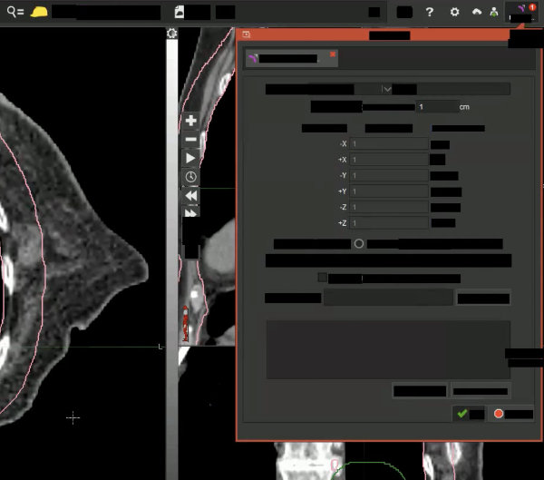

# Deidentify Screen Capture Media (PHI Redaction)

Author: Michael Gensheimer (michael.gensheimer@gmail.com) and Codex CLI.

## What This Repo Does

This repo removes on-screen PHI from images/videos using PaddleOCR and can deidentify subtitle text.

Primary scripts:

- `process_study_videos.py`
- `batch_remove_text_from_video_paddleocr.py`
- `remove_text_from_image_paddleocr.py`
- `remove_text_from_video_paddleocr.py`
- `deidentify_subtitles.py`

Sample output:



The process is not 100% reliable. Continue treating output as potentially containing PHI.

## Prerequisites

Required for core scripts:

- `uv`
- `ffmpeg` (for video recompression in scripts that use `--target-bitrate`)
- Python deps from `pyproject.toml` (installed via `uv` workflow)
- `PaddlePaddle` (install first): [https://www.paddlepaddle.org.cn/en](https://www.paddlepaddle.org.cn/en)
- `paddleocr` for Paddle scripts (install after PaddlePaddle; intentionally not installed by default in this repo)
  - GPU is optional: scripts run on CPU by default unless your Paddle installation is GPU-enabled and configured.

Needed for specific workflows:

- `ollama` model runtime for local subtitle deidentification
- Google Vertex AI access for `deidentify_subtitles.py --use-gemini`

## Whitelist Files

- `whitelist_terms.txt`
- `whitelist_regex.txt`

Detected text boxes matching either file are preserved (not blacked out).

Current whitelist usage:

- `remove_text_from_image_paddleocr.py`
- `remove_text_from_video_paddleocr.py`

Matching behavior is case-sensitive substring/regex matching in script logic. Very short OCR text (length `<= 3`) is treated as keep.

## Quick Start

### PaddleOCR Image Redaction

```bash
uv run remove_text_from_image_paddleocr.py \
  -i input/tps.jpeg \
  -o output/output_image_paddleocr.png
```

### PaddleOCR Video Redaction

```bash
uv run remove_text_from_video_paddleocr.py \
  -i input/test_recording.mov \
  -o output/output_video_paddleocr.mp4 \
  --interval 2 \
  --extra-keyframes 1 \
  --target-bitrate 1500k
```

Useful flags:

- `--interval`
- `--extra-keyframes`
- `--target-bitrate`
- `--only_first_seconds N`
- `-v/--verbose`

## Subtitle Deidentification

Basic (local Ollama):

```bash
uv run deidentify_subtitles.py -i input.srt -o output_cleaned.srt
# or
uv run deidentify_subtitles.py -i input.vtt -o output_cleaned.vtt
```

Gemini (Vertex AI):

```bash
uv run deidentify_subtitles.py \
  -i input.srt \
  -o output_cleaned.srt \
  --use-gemini \
  --google-project YOUR_PROJECT
```

For `process_study_videos.py`, set your project in a local `.env` file (not tracked):

```bash
cp .env.example .env
# then edit .env and set GOOGLE_PROJECT
```

## Batch Processing

Project-specific post-processing script:

```bash
uv run process_study_videos.py
```

Generic local input/output batch runner:

```bash
uv run batch_remove_text_from_video_paddleocr.py --max-videos 5
```

- Processes every `.mp4` and `.mov` file in `input/`
- Writes to `output/` with `_deid` suffix (example: `video1.mp4` -> `video1_deid.mp4`)
- Skips files whose target output already exists
- Uses fixed settings:
  - `--interval 4`
  - `--extra-keyframes 2`
  - `--target-bitrate 1000k`

## Notes

- Default `uv run ...` execution is expected for all scripts.
- Video scripts remove audio when re-encoding with ffmpeg in current implementation (`-an`).
- For quick test cycles on videos, use `--only_first_seconds`.
